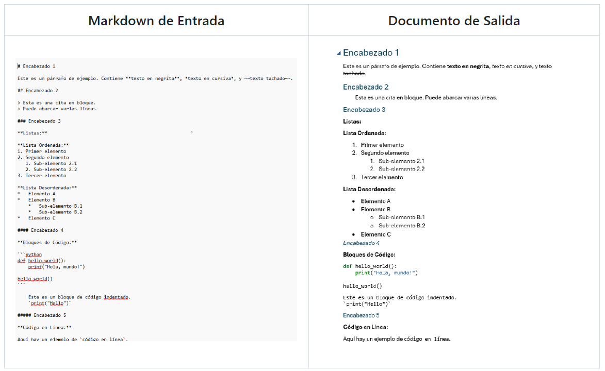

# MW Convert

MW Convert es una aplicación de escritorio intuitiva y fácil de usar diseñada para convertir archivos Markdown (`.md`) a documentos DOCX (`.docx`) con soporte para plantillas personalizadas.

---

## ✨ Galería de la Aplicación

| Interfaz Principal | Manual de Ayuda Integrado | Acerca de |
| :---: | :---: | :---: |
|  |  |  |

### Conversión de Alta Fidelidad

Transforma texto plano en documentos profesionales con un solo clic.

| Markdown de Entrada | Documento de Salida | Antes y Después |
| :---: | :---: | :---: |
|  |  |  |

---

## Características

-   **Conversión Robusta:** Convierte tus archivos Markdown a DOCX utilizando el potente motor de Pandoc, asegurando una fidelidad de estilo y formato excepcional.
-   **Plantillas DOCX Personalizadas:** Aplica tus propias plantillas DOCX para dar a tus documentos convertidos un estilo y diseño profesional y consistente.
-   **Flujo de Trabajo de 3 Pasos:** Una interfaz clara y guiada que te lleva a través de la selección del archivo, la elección de la plantilla (opcional) y la conversión.
-   **Entrada Flexible:** Selecciona archivos Markdown mediante un explorador de archivos o simplemente arrástralos y suéltalos en la aplicación.
-   **Acceso Rápido a Salida:** Abre directamente el documento DOCX convertido o la carpeta que lo contiene con un solo clic.
-   **Interfaz de Usuario Moderna:** Disfruta de una experiencia visual agradable con un tema oscuro moderno y una disposición limpia.

## Requisitos

Para ejecutar MW Convert, necesitas tener instalado lo siguiente:

-   **Python 3.7 o superior:** Puedes descargarlo desde [python.org](https://www.python.org/).
-   **PySide6:** La biblioteca de Python para la interfaz gráfica de usuario.
-   **Pandoc:** Una herramienta universal de conversión de documentos. Asegúrate de que esté instalado y accesible desde la línea de comandos (añadido a tu PATH).
    -   Descarga Pandoc desde [pandoc.org/installing.html](https://pandoc.org/installing.html).

## Instalación

Sigue estos pasos para configurar y ejecutar MW Convert en tu máquina local:

1.  **Clona el repositorio:**
    ```bash
    git clone https://github.com/mikeear/MW-Convert.git
    cd MW-Convert
    ```

2.  **Instala las dependencias de Python:**
    ```bash
    pip install -r requirements.txt
    ```

3.  **Asegúrate de que Pandoc esté instalado** y configurado en tu sistema como se menciona en la sección de Requisitos.

## Uso

Para iniciar la aplicación, ejecuta el siguiente comando desde el directorio raíz del proyecto:

```bash
python gui_app.py
```

Una vez que la aplicación esté abierta, sigue el flujo de trabajo de 3 pasos:

1.  **Selecciona o arrastra** tu archivo Markdown.
2.  **Selecciona una plantilla DOCX** (opcional).
3.  **Haz clic en "Convertir a DOCX"** y luego abre tu documento o la carpeta de salida.

## Créditos

Desarrollado por **Diego A. Rábalo**

-   **Github:**  [Diego A. Rábalo | Criminólogo & Python Developer](https://github.com/mikear) 
-   **LinkedIn:** [Perfil de Diego A. Rábalo](https://www.linkedin.com/in/rabalo)
-   **Correo Electrónico:** [diego_rabalo@hotmail.com](mailto:diego_rabalo@hotmail.com)

## Colaborar

Si encuentras MW Convert útil y te gustaría apoyar su desarrollo, puedes hacer una donación a través de PayPal:

[](https://paypal.me/diegorabalo)

## Licencia

Este proyecto está bajo la licencia MIT. Consulta el archivo `LICENSE` para más detalles.

